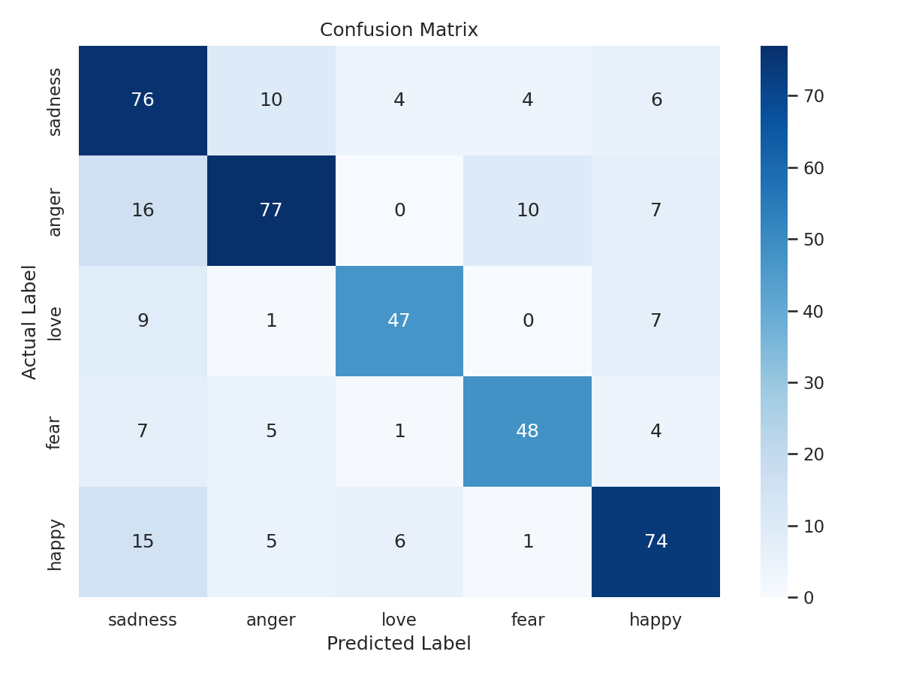
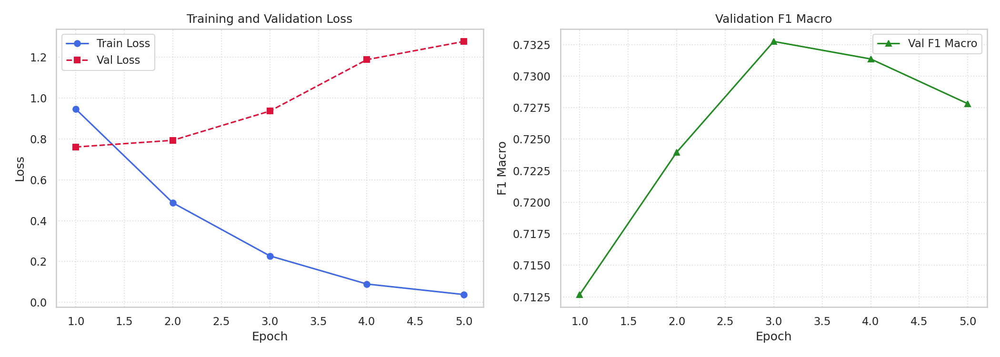
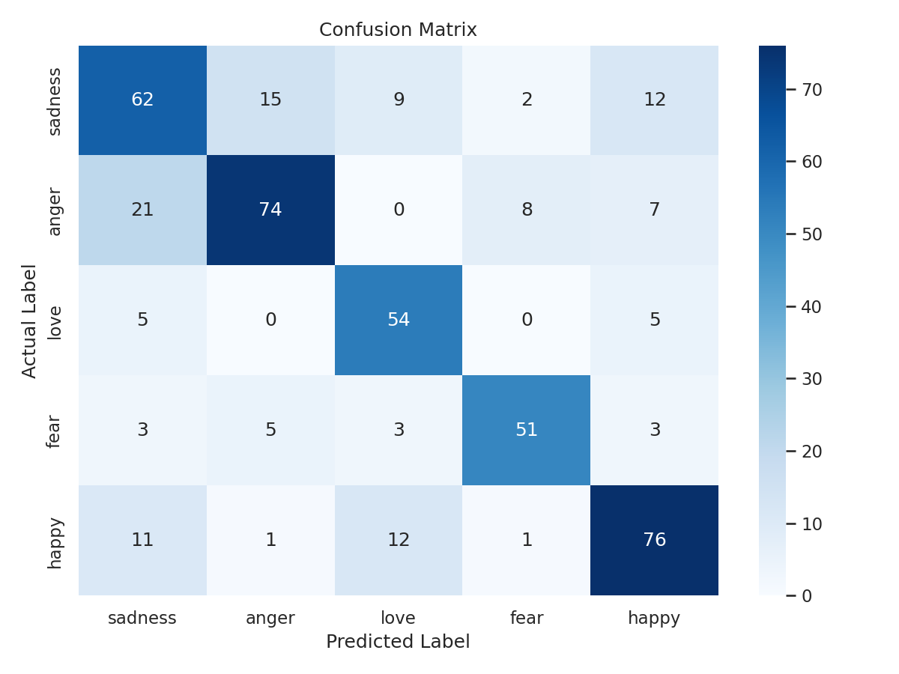
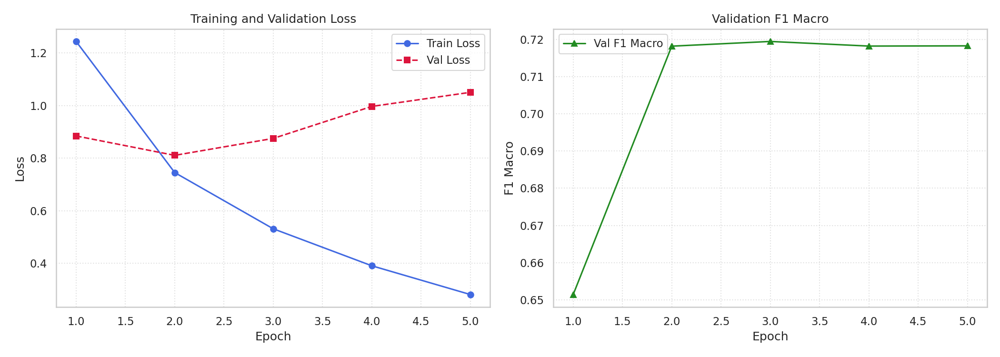

# Laporan Tugas Akhir: Emotion Detection pada Teks Bahasa Indonesia

**Mata Kuliah**: Text Analytics
**Task**: Text Classification — Deteksi Emosi (5 kelas)

---

## 1. Pendahuluan & Tujuan

Tugas ini bertujuan untuk melakukan *fine-tuning* pre-trained language model untuk tugas klasifikasi emosi pada teks Bahasa Indonesia. Secara spesifik, laporan ini mencakup:

1. Proses *fine-tuning* dua pre-trained language model — satu model monolingual Bahasa Indonesia dan satu model multilingual — pada dataset yang sama.
2. Eksperimen *hyperparameter tuning* (learning rate, jumlah epoch) secara bertahap untuk masing-masing model.
3. Evaluasi performa kedua model menggunakan metrik akurasi dan Macro F1-Score, dilengkapi *confusion matrix* dan kurva training.
4. Perbandingan dan analisis performa antar model, dikaitkan dengan karakteristik arsitektur masing-masing (monolingual vs multilingual).

Task yang dipilih adalah **klasifikasi emosi** (5 kelas: *sadness, anger, love, fear, happy*) pada teks tweet Bahasa Indonesia.

---

## 2. Deskripsi Dataset

Dataset yang digunakan adalah **IndoNLU EmoT** (Emotion Twitter Dataset), bagian dari benchmark IndoNLU (Wilie dkk., 2020), diakses melalui Hugging Face Datasets (`indonlp/indonlu`, konfigurasi `emot`).

**Ukuran dataset** (split resmi dari sumber, digunakan langsung tanpa split ulang):

| Split | Jumlah Sampel |
|---|---|
| Train | 3.521 |
| Validation | 440 |
| Test | 440 |
| **Total** | **4.401** |

**Jumlah kelas**: 5 kelas emosi, dengan distribusi pada data training sebagai berikut:

| Emosi | Jumlah Sampel (Train) |
|---|---|
| anger | 881 |
| happy | 814 |
| sadness | 798 |
| fear | 519 |
| love | 509 |

Terdapat ketidakseimbangan kelas yang **moderat** (rasio ± 1,7 : 1 antara kelas mayoritas *anger* dan kelas minoritas *love*), namun tidak ekstrem. Oleh karena itu, digunakan *cross-entropy loss* standar tanpa *class weighting* tambahan, dengan **Macro F1-Score** sebagai metrik evaluasi utama (bukan hanya akurasi) karena metrik ini memberi bobot setara ke setiap kelas terlepas dari ukurannya — penting untuk data yang tidak sepenuhnya seimbang.

**Karakteristik teks**: panjang tweet berkisar 2–80 kata, dengan rata-rata 28,9 kata (median 28 kata). Berdasarkan ini, panjang token maksimum `max_length=96` yang digunakan pada tahap tokenisasi sudah cukup aman untuk mencakup hampir seluruh tweet tanpa terpotong signifikan.

---

## 3. Preprocessing & Tokenisasi

Tahapan preprocessing yang dilakukan (diimplementasikan pada `src/data.py`):

1. **Pembersihan teks (text cleaning)**: menghapus URL, mention (`@username`), simbol hashtag, dan whitespace berlebih dari tiap tweet — dilakukan sebelum tokenisasi karena data berasal dari Twitter yang mengandung banyak noise khas media sosial.
2. **Tokenisasi**: menggunakan `AutoTokenizer` yang sesuai untuk masing-masing model (tokenizer IndoBERT dan tokenizer XLM-RoBERTa berbeda satu sama lain — masing-masing dipakai sesuai model yang di-*fine-tune*), dengan `max_length=96`, `padding="max_length"`, dan `truncation=True`.
3. **Split data**: menggunakan split train/validation/test resmi dari IndoNLU EmoT (tidak dilakukan split ulang), demi konsistensi dengan benchmark yang sudah ada.
4. **Penanganan imbalance**: dilakukan pengecekan distribusi kelas (lihat Bagian 2). Karena imbalance tergolong moderat, tidak diterapkan teknik *oversampling*/*class weighting* — cukup diantisipasi lewat pemilihan metrik Macro F1 sebagai acuan utama evaluasi.

---

## 4. Pemilihan Pre-trained Model

Dua model dipilih untuk dibandingkan, mewakili dua pendekatan berbeda:

| Model | Hugging Face ID | Jenis | Parameter |
|---|---|---|---|
| IndoBERT | `indobenchmark/indobert-base-p1` | Monolingual (Bahasa Indonesia) | ±110 juta |
| XLM-RoBERTa | `xlm-roberta-base` | Multilingual (100+ bahasa) | ±125 juta |

Pemilihan ini didasari oleh keinginan untuk menjawab pertanyaan: **apakah model monolingual yang dilatih khusus pada korpus Bahasa Indonesia (IndoBERT) memberikan keunggulan performa dibanding model multilingual besar (XLM-RoBERTa) untuk tugas klasifikasi emosi berbasis teks media sosial berbahasa gaul/informal?**

---

## 5. Implementasi Fine-Tuning

Pendekatan yang digunakan adalah **full fine-tuning** (bukan LoRA), menggunakan `transformers.Trainer`, dengan alasan: ukuran model (kelas *base*, ±110–125 juta parameter) dan dataset (~3.500 sampel training) tergolong ringan, sehingga full fine-tuning dapat dilakukan dengan efisien pada GPU T4 (Google Colab, free tier) tanpa memerlukan teknik efisiensi parameter tambahan.

Konfigurasi umum yang digunakan pada seluruh eksperimen:
- `load_best_model_at_end=True`, `metric_for_best_model="f1_macro"` — model yang disimpan otomatis adalah checkpoint dengan validation Macro F1 terbaik, bukan epoch terakhir.
- `EarlyStoppingCallback(patience=2)` — training dihentikan otomatis jika validation Macro F1 tidak membaik selama 2 epoch berturut-turut, untuk mencegah overfitting.
- `save_total_limit=1` — hanya menyimpan 1 checkpoint terbaik pada satu waktu, untuk efisiensi penggunaan disk pada Google Colab.

---

## 6. Eksperimen Hyperparameter Tuning

Untuk efisiensi komputasi (mengingat keterbatasan kuota GPU gratis Google Colab), digunakan strategi **pencarian bertahap** alih-alih *grid search* penuh:

- **Tahap 1 — Pencarian Learning Rate**: mengunci `batch_size=16` dan `num_epochs=5`, menguji `learning_rate` ∈ {1e-5, 2e-5, 5e-5} untuk kedua model.
- **Tahap 2 — Eksplorasi Jumlah Epoch**: menggunakan learning rate hasil Tahap 1, menguji jumlah epoch maksimum ∈ {3, 5, 10} dengan *early stopping* aktif.

**Justifikasi nilai hyperparameter**:
- *Learning rate* {1e-5, 2e-5, 5e-5}: rentang standar yang direkomendasikan oleh paper BERT asli (Devlin dkk.) untuk *fine-tuning*; 1e-5 ditambahkan sebagai batas bawah untuk melihat efek konvergensi yang lebih konservatif.
- *Batch size* 16: dipilih sebagai nilai aman untuk memori GPU T4 (16GB) pada Colab *free tier*, dengan sequence length pendek (96 token) sehingga masih ada ruang cukup untuk stabilitas training.
- *Epoch* {3, 5, 10}: karena dataset relatif kecil (~3.500 sampel training), model berisiko *overfitting* jika dipaksa training terlalu lama — jumlah ini dipantau bersama *early stopping* untuk menemukan titik henti optimal.

### 6.1 Hasil Tahap 1 — Pencarian Learning Rate

*(Diukur pada validation set, digunakan sebagai basis pemilihan learning rate terbaik; kolom test set ditampilkan sebagai referensi tambahan)*

| Model | Learning Rate | Val Accuracy | Val F1 Macro | Test Accuracy | Test F1 Macro |
|---|---|---|---|---|---|
| IndoBERT | 1e-5 | 0.7227 | **0.7314** | 0.7409 | 0.7494 |
| IndoBERT | 2e-5 | 0.7068 | 0.7127 | 0.7341 | 0.7390 |
| IndoBERT | 5e-5 | 0.7091 | 0.7164 | 0.7295 | 0.7383 |
| XLM-RoBERTa | 1e-5 | 0.7250 | 0.7311 | 0.7341 | 0.7400 |
| XLM-RoBERTa | 2e-5 | 0.7295 | **0.7406** | 0.7227 | 0.7312 |
| XLM-RoBERTa | 5e-5 | 0.7227 | 0.7277 | 0.7159 | 0.7221 |

**Learning rate terbaik berdasarkan validation Macro F1**: IndoBERT → **1e-5**, XLM-RoBERTa → **2e-5**.

> **Catatan metodologis**: Pada notebook `04_hyperparameter_tuning.ipynb`, Tahap 2 (eksplorasi epoch) sempat menggunakan LR=2e-5 untuk kedua model (termasuk IndoBERT) sebagai simplifikasi, alih-alih LR=1e-5 yang sebenarnya terbukti terbaik untuk IndoBERT pada Tahap 1. Ini adalah keterbatasan pada proses tuning yang perlu dicatat sebagai catatan metodologis — hasil terbaik IndoBERT secara keseluruhan (Bagian 6.3) tetap ditemukan lewat kombinasi LR=1e-5 pada Tahap 1.

### 6.2 Hasil Tahap 2 — Eksplorasi Jumlah Epoch (LR=2e-5, batch=16)

| Model | Max Epoch | Test Accuracy | Test F1 Macro |
|---|---|---|---|
| IndoBERT | 3 | 0.7409 | **0.7479** |
| IndoBERT | 5 | 0.7227 | 0.7269 |
| IndoBERT | 10 | 0.7114 | 0.7136 |
| XLM-RoBERTa | 3 | 0.7250 | 0.7332 |
| XLM-RoBERTa | 5 | 0.7295 | **0.7385** |
| XLM-RoBERTa | 10 | 0.7182 | 0.7239 |

Pola yang konsisten terlihat pada kedua model: performa cenderung **menurun** seiring epoch maksimum yang lebih besar (terutama pada epoch=10), mengindikasikan *overfitting* pada dataset yang relatif kecil ini. IndoBERT justru mencapai performa terbaiknya di epoch=3, sedangkan XLM-RoBERTa di epoch=5 — namun secara keseluruhan pola ini memperkuat pentingnya *early stopping* yang sudah diaktifkan.

### 6.3 Konfigurasi Terbaik Keseluruhan

| Model | Konfigurasi Terbaik | Test Accuracy | Test F1 Macro |
|---|---|---|---|
| **IndoBERT** | LR=1e-5, batch=16, epoch=5 | **0.7409** | **0.7494** |
| **XLM-RoBERTa** | LR=1e-5, batch=16, epoch=5 | 0.7341 | 0.7400 |

Berdasarkan seluruh eksperimen yang dilakukan (baseline, tuning LR, tuning epoch), konfigurasi **LR=1e-5 dengan 5 epoch** ternyata memberikan hasil terbaik untuk kedua model — dan **IndoBERT tetap unggul tipis** dibanding XLM-RoBERTa pada konfigurasi optimalnya masing-masing.

---

## 7. Evaluasi & Visualisasi

### 7.1 Classification Report — IndoBERT (Konfigurasi Baseline: LR=2e-5, epoch=5)

```
              precision    recall  f1-score   support

     sadness       0.62      0.76      0.68       100
       anger       0.79      0.70      0.74       110
        love       0.81      0.73      0.77        64
        fear       0.76      0.74      0.75        65
       happy       0.76      0.73      0.74       101

    accuracy                           0.73       440
   macro avg       0.75      0.73      0.74       440
weighted avg       0.74      0.73      0.73       440
```

### 7.2 Classification Report — XLM-RoBERTa (Konfigurasi Baseline: LR=2e-5, epoch=5)

```
              precision    recall  f1-score   support

     sadness       0.61      0.62      0.61       100
       anger       0.78      0.67      0.72       110
        love       0.69      0.84      0.76        64
        fear       0.82      0.78      0.80        65
       happy       0.74      0.75      0.75       101

    accuracy                           0.72       440
   macro avg       0.73      0.73      0.73       440
weighted avg       0.72      0.72      0.72       440
```

### 7.3 Confusion Matrix

**Confusion Matrix — IndoBERT** (baris = label aktual, kolom = label prediksi)

| Aktual \ Prediksi | sadness | anger | love | fear | happy |
|---|---|---|---|---|---|
| **sadness** | 76 | 10 | 4 | 4 | 6 |
| **anger** | 16 | 77 | 0 | 10 | 7 |
| **love** | 9 | 1 | 47 | 0 | 7 |
| **fear** | 7 | 5 | 1 | 48 | 4 |
| **happy** | 15 | 5 | 6 | 1 | 74 |

**Confusion Matrix — XLM-RoBERTa** (baris = label aktual, kolom = label prediksi)

| Aktual \ Prediksi | sadness | anger | love | fear | happy |
|---|---|---|---|---|---|
| **sadness** | 62 | 15 | 9 | 2 | 12 |
| **anger** | 21 | 74 | 0 | 8 | 7 |
| **love** | 5 | 0 | 54 | 0 | 5 |
| **fear** | 3 | 5 | 3 | 51 | 3 |
| **happy** | 11 | 1 | 12 | 1 | 76 |

Visualisasi lengkap (heatmap confusion matrix dan kurva training loss/F1 per epoch):

#### IndoBERT (Baseline)

*Gambar 1: Confusion Matrix IndoBERT*


*Gambar 2: Kurva Loss dan F1 IndoBERT*

#### XLM-RoBERTa (Baseline)

*Gambar 3: Confusion Matrix XLM-RoBERTa*


*Gambar 4: Kurva Loss dan F1 XLM-RoBERTa*

**Observasi dari confusion matrix**:
- Pada **kedua model**, kesalahan klasifikasi terbesar adalah **kelas *anger* yang salah diprediksi sebagai *sadness*** (IndoBERT: 16 kasus; XLM-RoBERTa: 21 kasus) — mengindikasikan kedua emosi ini memiliki tumpang tindih leksikal/konteks yang tinggi pada teks Twitter Bahasa Indonesia (tweet yang mengekspresikan kemarahan sering ditulis dengan nada yang juga terdengar sedih/kecewa).
- Kelas *happy* juga cukup sering salah diprediksi sebagai *sadness* pada IndoBERT (15 kasus), namun pada XLM-RoBERTa polanya bergeser: *happy* justru lebih sering tertukar dengan *love* (12 kasus) dibanding *sadness* (11 kasus) — mengindikasikan XLM-RoBERTa menangkap kemiripan antara ekspresi "senang" dan "cinta/sayang" yang secara linguistik memang berdekatan, sementara IndoBERT lebih condong salah mengarah ke *sadness* untuk kasus yang ambigu.
- Kelas *love* dan *fear* relatif paling "bersih" pada kedua model (diagonal dominan, sedikit kebocoran ke kelas lain), menunjukkan kedua model sama-sama dapat mengenali pola linguistik khas kedua emosi ini dengan baik.
- XLM-RoBERTa menunjukkan kebocoran yang **lebih besar** dari kelas *sadness* ke kelas lain (15 ke *anger*, 12 ke *happy*, 9 ke *love* — total 38 dari 100 sampel *sadness* salah klasifikasi) dibanding IndoBERT (10+4+4+6=24 dari 100 salah klasifikasi) — ini konsisten dengan recall *sadness* XLM-RoBERTa yang lebih rendah (0.62) dibanding IndoBERT (0.76) pada classification report Bagian 7.1–7.2, dan menjadi salah satu kontributor utama F1 Macro XLM-RoBERTa yang lebih rendah secara keseluruhan.

---

## 8. Analisis & Perbandingan Antar Model

**1. IndoBERT vs XLM-RoBERTa — performa keseluruhan**

Pada konfigurasi baseline (LR=2e-5, 5 epoch), IndoBERT sedikit unggul dibanding XLM-RoBERTa (Test F1 Macro 0.7372 vs 0.7289). Keunggulan ini **konsisten** ditemukan lagi setelah hyperparameter tuning — pada konfigurasi terbaik masing-masing (LR=1e-5, 5 epoch), IndoBERT tetap unggul (F1 Macro 0.7494 vs 0.7400).

Hasil ini sejalan dengan hipotesis awal: model **monolingual** yang dilatih khusus pada korpus besar Bahasa Indonesia (Indo4B) memiliki representasi kosakata dan konteks berbahasa Indonesia — termasuk bahasa informal/gaul khas Twitter — yang lebih baik dibanding model multilingual seperti XLM-RoBERTa yang harus "berbagi" kapasitas representasinya di antara 100+ bahasa.

**2. Performa per kelas emosi**

Menariknya, pola keunggulan antar model **tidak seragam di semua kelas**. XLM-RoBERTa justru lebih unggul pada kelas *fear* (F1 0.80 vs 0.75) dan *love* (F1 0.76 vs 0.77, relatif setara), sementara IndoBERT jelas lebih unggul pada kelas *anger* (F1 0.74 vs 0.72) dan terutama *sadness* (F1 0.68 vs 0.61). Ini mengindikasikan bahwa keunggulan model monolingual tidak berlaku merata di semua jenis ekspresi emosi — kemungkinan kelas *sadness* dan *anger* banyak memuat idiom/istilah informal Bahasa Indonesia yang lebih dikenali oleh IndoBERT, sedangkan *fear* dan *love* memiliki pola ekspresi yang lebih universal/mirip lintas bahasa sehingga XLM-RoBERTa yang terekspos banyak bahasa justru diuntungkan.

Analisis confusion matrix (Bagian 7.3) memperkuat temuan ini: selisih performa terbesar antar kedua model terletak pada kelas **sadness**, di mana XLM-RoBERTa kehilangan 38 dari 100 sampel ke kelas lain (terutama ke *anger* dan *happy*), jauh lebih banyak dibanding kebocoran IndoBERT yang hanya 24 dari 100 sampel. Kelas *sadness* pada data Twitter Bahasa Indonesia kemungkinan besar diekspresikan lewat kombinasi kata/idiom informal yang sangat spesifik konteks budaya (misal sindiran halus, curahan hati bernada pasrah) — pola yang lebih mudah dikenali model yang representasi bahasanya terfokus penuh pada Bahasa Indonesia (IndoBERT) dibanding model yang kapasitas representasinya terbagi ke 100+ bahasa (XLM-RoBERTa).

**3. Efek Hyperparameter**

- **Learning rate**: LR=1e-5 (paling konservatif dari tiga kandidat) justru menghasilkan performa terbaik untuk kedua model — mengindikasikan bahwa update bobot yang lebih halus/lambat lebih menguntungkan untuk dataset kecil ini, kemungkinan karena mengurangi risiko model "melompati" solusi optimal pada data training yang terbatas.
- **Jumlah epoch**: baik IndoBERT maupun XLM-RoBERTa sama-sama menunjukkan penurunan performa pada epoch=10, mengonfirmasi terjadinya *overfitting* jika training dipaksa terlalu lama pada dataset sekecil ini (~3.500 sampel). Ini memperkuat pentingnya strategi *early stopping* yang diterapkan pada seluruh eksperimen.
- **Kecepatan training**: XLM-RoBERTa secara konsisten membutuhkan waktu training 2–3× lebih lama dibanding IndoBERT pada konfigurasi identik (misal ±11 menit vs ±5 menit untuk 5 epoch), sejalan dengan ukuran vocab dan parameter XLM-RoBERTa yang lebih besar.

**4. Keterbatasan penelitian**

- Eksplorasi hyperparameter menggunakan strategi bertahap (bukan grid search penuh) demi efisiensi komputasi pada GPU gratis Colab — kombinasi learning rate dan epoch secara bersamaan (misal LR=1e-5 dengan epoch=10) belum dieksplorasi, sehingga kombinasi optimal yang benar-benar global belum dapat dipastikan.
- Terdapat inkonsistensi kecil pada Tahap 2 (lihat catatan Bagian 6.1) di mana IndoBERT dieksplorasi menggunakan LR=2e-5, bukan LR=1e-5 yang terbukti lebih optimal di Tahap 1 — sehingga hasil terbaik IndoBERT yang dilaporkan (Bagian 6.3) berasal dari kombinasi hasil Tahap 1, bukan Tahap 2.
- Dataset berukuran relatif kecil (~4.400 sampel total) sehingga hasil evaluasi berpotensi memiliki varians yang cukup besar antar-run (perbedaan *seed* atau inisialisasi bobot dapat mengubah hasil beberapa poin persentase, seperti terlihat pada perbedaan kecil hasil baseline XLM-RoBERTa antar-eksperimen yang menggunakan konfigurasi identik).

---

## 9. Kesimpulan

1. Kedua model (IndoBERT dan XLM-RoBERTa) berhasil di-*fine-tune* untuk tugas klasifikasi emosi Bahasa Indonesia dengan performa yang layak (Macro F1 di kisaran 0.72–0.75).
2. **IndoBERT (model monolingual) secara konsisten sedikit mengungguli XLM-RoBERTa (model multilingual)** pada task ini, baik pada konfigurasi baseline maupun setelah hyperparameter tuning — mendukung hipotesis bahwa spesialisasi bahasa memberikan keunggulan untuk NLU berbahasa Indonesia, khususnya teks informal media sosial.
3. Learning rate paling konservatif (1e-5) dan jumlah epoch moderat (5, dengan early stopping) terbukti menjadi konfigurasi optimal untuk kedua model pada dataset berukuran kecil ini.
4. Performa per-kelas menunjukkan bahwa keunggulan model monolingual tidak seragam — beberapa kelas emosi (*fear*, *love*) justru lebih baik ditangani oleh model multilingual, sehingga pemilihan model idealnya juga mempertimbangkan distribusi kelas yang menjadi prioritas aplikasi.

---

## 10. Referensi

1. Wilie, B., Vincentio, K., Winata, G. I., dkk. (2020). *IndoNLU: Benchmark and Resources for Evaluating Indonesian Natural Language Understanding*. AACL-IJCNLP 2020.
2. Devlin, J., Chang, M. W., Lee, K., & Toutanova, K. (2019). *BERT: Pre-training of Deep Bidirectional Transformers for Language Understanding*. NAACL 2019.
3. Conneau, A., Khandelwal, K., Goyal, N., dkk. (2020). *Unsupervised Cross-lingual Representation Learning at Scale* (XLM-RoBERTa). ACL 2020.
4. Dokumentasi Hugging Face Transformers: https://huggingface.co/docs/transformers
5. Dokumentasi Hugging Face Datasets: https://huggingface.co/docs/datasets
6. Dataset IndoNLU EmoT: https://huggingface.co/datasets/indonlp/indonlu (konfigurasi `emot`)
7. Model IndoBERT: https://huggingface.co/indobenchmark/indobert-base-p1
8. Model XLM-RoBERTa: https://huggingface.co/xlm-roberta-base

---

*Seluruh kode, notebook, dan hasil eksperimen tersedia di repository: https://github.com/dewasatria11/TA-emotion-detection-id*